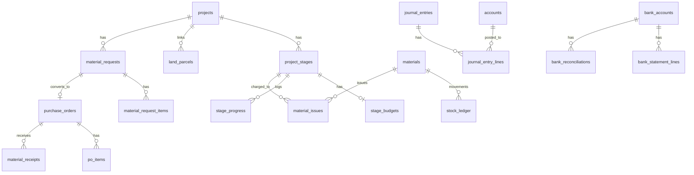

# Database

Source of truth: TypeORM entities under `backend/server/src/**/entities/` (**36** tables). Schema is applied via TypeORM `synchronize: true` — **not** Prisma migrations. See [Decisions.md](Decisions.md).

There is **no** generic `tasks` table. Construction work breakdown is `project_stages` (plus `stage_budgets` / `stage_progress`).

## Conventions

| Pattern | Meaning |
|---------|---------|
| PK | Usually `id` `bigint` unsigned, auto-generated (TypeScript `string`) |
| Timestamps | `created_at` / `updated_at` default `CURRENT_TIMESTAMP`; `updated_at` often `onUpdate` |
| Soft FKs | Many `project_id` / `*_by` columns exist without `@ManyToOne` — still treat as FKs logically |
| Money / qty | `decimal` stored; entities expose as `string` in TS |

## Core ER (project + material trail)

Extended diagram also lives in [Architecture.md](Architecture.md).

---

## Users

### `roles`

| Column | Type | Notes |
|--------|------|-------|
| `id` | bigint PK | |
| `name` | varchar(50) unique | |
| `description` | varchar(255) nullable | |
| `created_at`, `updated_at` | timestamp | |

→ `users`, `role_permissions`

### `permissions`

| Column | Type | Notes |
|--------|------|-------|
| `id` | bigint PK | |
| `code` | varchar(100) unique | |
| `name` | varchar(100) | |
| `description` | varchar(255) nullable | |
| `created_at`, `updated_at` | timestamp | |

### `role_permissions`

Composite PK: `role_id` + `permission_id` → `roles`, `permissions`.

### `users`

| Column | Type | Notes |
|--------|------|-------|
| `id` | bigint PK | |
| `name` | varchar(100) | |
| `email` | varchar(150) unique | |
| `password_hash` | varchar(255) | |
| `role_id` | bigint FK → `roles` | |
| `is_active` | boolean default true | |
| `last_login_at` | timestamp nullable | |
| `created_at`, `updated_at` | timestamp | |

---

## Projects

### `projects`

| Column | Type | Notes |
|--------|------|-------|
| `id` | bigint PK | |
| `name` | varchar(150) | |
| `location`, `plot_size`, `project_type` | varchar nullable | |
| `start_date`, `expected_completion_date` | date nullable | |
| `total_estimated_budget` | decimal(18,2) nullable | Cost budget |
| `target_sale_price` | decimal(18,2) nullable | Target sale / exit price |
| `status` | varchar(50) default `Planning` | string, not DB enum |
| `created_at`, `updated_at` | timestamp | |

Hub for most domains via soft `project_id`.

### `project_stages`

| Column | Type | Notes |
|--------|------|-------|
| `id` | bigint PK | |
| `project_id` | bigint FK → `projects` | |
| `name` | varchar(100) | |
| `description` | varchar(255) nullable | |
| `sequence_order` | int default 0 | |
| `start_date`, `end_date` | date nullable | |
| `completion_percent` | decimal(5,2) default 0 | |
| `status` | varchar(50) default `Planned` | |
| `created_at`, `updated_at` | timestamp | |

### `stage_budgets`

1:1 with stage via `project_stage_id`. Budgets: `labour_budget`, `material_budget`, `equipment_budget`, `other_budget`, `total_budget` (all decimal 18,2, default 0).

### `stage_progress`

| Column | Type | Notes |
|--------|------|-------|
| `project_stage_id` | FK → stages | |
| `report_date` | date | |
| `completion_percent` | decimal(5,2) | |
| `notes` | text nullable | |
| `has_delay` | boolean default false | |
| `created_at` | timestamp | no `updated_at` |

---

## Land

### `land_parcels`

Optional `project_id`. Identity/location: `plot_number`, `owner_name`, `owner_cnic`, `owner_phone`, `location`, `area`, `area_sqft`. Title docs: agreement/deed numbers, dates, registrar, **file URL** fields (`purchase_agreement_file`, `sale_deed_file`). Commercial: `purchase_price`, `purchase_date`. `status` varchar default `Owned`.

---

## Procurement

### `suppliers`

`name`, contact fields, `category`, `payment_terms`, `address`, `is_active` default true.

### `material_requests`

| Column | Notes |
|--------|-------|
| `request_no` | unique |
| `project_id` | required; `project_stage_id` optional |
| `requested_by` | → users |
| `request_date`, `needed_by_date` | |
| `status` | **enum**: `Draft`, `Submitted`, `Approved`, `Rejected`, `Converted`, `Cancelled` (default Draft) |
| `approved_by`, `approved_at`, `rejection_reason` | |
| `purchase_order_id` | set after convert |

### `material_request_items`

FK `material_request_id`; optional `material_id`; denormalized `material_name`, `unit`; `quantity_requested`, `quantity_approved`, `estimated_unit_cost`, `notes`.

### `purchase_orders`

`project_id`, optional `project_stage_id` / `material_request_id` / `created_by`; required `supplier_id`. Dates: `order_date`, `expected_delivery`. **enum** `status`: `Draft`, `Approved`, `Received`, `Cancelled`. `total_amount` decimal.

### `po_items`

FK `purchase_order_id`; optional `material_id`, `material_request_item_id`; `material_name`, `unit`, `quantity`, `unit_price`, `total_price`, `received_qty` default 0.

### `material_receipts`

Header only (no line entity): `purchase_order_id`, `receipt_date`, `status` default `Received`, `notes`, `created_at`. Receipt API also writes `stock_ledger` RECEIPT rows.

---

## Inventory

### `materials`

Unique `name`; `unit`, `category`; `min_stock_level`, `standard_unit_cost`; `description`; `is_active`.

### `stock_ledger`

Append-only movements. `movement_type` varchar (app uses `RECEIPT`, `ISSUE`, `TRANSFER_IN`, `TRANSFER_OUT`, `ADJUSTMENT`, `RETURN`). `quantity`, `unit_cost`, `total_cost`; optional `project_id`, `project_stage_id`, `purchase_order_id`; `movement_date`, `reference_no`, `notes`.

### `material_issues`

`material_id`, `project_id`, optional `project_stage_id`; `issue_date`, `quantity`, costs, `purpose`, `reference_no`, `notes`.

---

## Labour

### `labour_contractors`

`name`, `contractor_type`, contact, `daily_rate`, `is_active`.

### `labour_attendance`

`contractor_id`, `project_id`, optional stage; `attendance_date`; `present_days` decimal default 1.00.

### `labour_advances`

`contractor_id`, `project_id`; `advance_date`, `amount`, `recovered_amount` default 0.

### `labour_payments`

`contractor_id`, `project_id`, optional stage; `payment_date`, `amount`, `payment_method`; optional `cash_transaction_id`.

---

## Expenses

### `expenses`

Required `project_id`, `project_stage_id`, `category`, `payment_type`, `expense_date`, `amount`. **enum** `vendor_type`: `SUPPLIER`, `LABOUR`, `OTHER` with optional `supplier_id` / `contractor_id`. **enum** `entry_mode`: `DIRECT` (pay now) | `BILL` (accrual). Optional `bank_account_id` → `bank_accounts` (required for Bank Transfer / Cheque). `paid_amount`, `status` (`Paid` / `Unpaid` / `Partial`). Optional `cash_transaction_id`. Land purchase uses expense category (costs not duplicated on parcels).

### `expense_payments`

Bill settlements: FK `expense_id`; `paid_date`, `amount`, `payment_method`, optional `bank_account_id`, `notes`. Auto JE `EXPPMT-{id}`: Dr AP / Cr bank or Cash.

---

## Funds & cashflow

### `fund_sources`

Primary link: required `bank_account_id` → `bank_accounts` (partner bank; banks default-link to COA `1000` Cash & Bank). Optional `project_id` → `projects` (for project-card rollups). `source_name`; **enum** `source_type`: `EQUITY`, `LOAN`, `INVESTOR`, `ADVANCE_SALES`, `OTHER`; `total_committed`, `received_so_far`; **status** varchar: `Committed` | `Partially_Received` | `Fully_Received` | `Cancelled` (derived from receipts except Cancelled, which is manual); `expected_date`, `notes`.

### `fund_transactions`

FK `fund_source_id`; `transaction_date`, `amount`; optional `cash_transaction_id`. Creating a receipt auto-posts JE `FUND-*`: Dr bank COA (or `1000`) / Cr by type (`2100` loan, `3000` equity/investor, `2200` advances, `4100` other).

### `cash_transactions`

Shared cash book. **enum** `type`: `IN`, `OUT`. `amount`, `method`, optional `reference_no` / `description`; optional `project_id` / `project_stage_id`; polymorphic `related_entity_type` + `related_entity_id`.

---

## Sales

### `customers`

`name`, `phone`, `email`, `cnic`, `address`.

### `property_units`

`project_id`, `unit_number`, `unit_type`, `area_sqft`, `floor`, `list_price`; **enum** `status`: `Available`, `Reserved`, `Sold`, `Blocked`.

### `sales`

FK `property_unit_id`, `customer_id`; `sale_date`, `total_sale_price`, `total_paid`; **enum** `status`: `Active`, `Cancelled`, `Completed`.

### `sale_installments`

FK `sale_id`; `due_date`, `due_amount`, `paid_amount`, `paid_date`; **enum** `status`: `Pending`, `Partial`, `Paid`, `Overdue`.

---

## Accounting

### `accounts`

COA: unique `code`, `name`; **enum** `type`: `ASSET`, `LIABILITY`, `EQUITY`, `INCOME`, `EXPENSE`; `is_active`; optional `parent_account_id`.

### `journal_entries`

`entry_date`, `reference_no`, `description`; **enum** `status`: `Draft`, `Posted`; optional `project_id`.

### `journal_entry_lines`

FK `journal_entry_id`, `account_id`; **enum** `dr_cr`: `DEBIT`, `CREDIT`; `amount`, `narration`.

### `bank_accounts`

Optional GL `account_id`; `name`, `bank_name`, `account_number`, `currency` default `PKR`, `opening_balance`, `is_active`.

### `bank_statement_lines`

`bank_account_id`, `statement_date`, `value_date`, `description`, `amount`, `reference`; `reconciled` default false; optional `cash_transaction_id`, `journal_entry_id`, `reconciled_at`.

### `bank_reconciliations`

`bank_account_id`, `period_start`, `period_end`; balances; `status` varchar default `Open`; `notes`; optional `created_by`.

---

## Entity count

| Domain | Tables | Count |
|--------|--------|------:|
| Users | roles, permissions, role_permissions, users | 4 |
| Projects | projects, project_stages, stage_budgets, stage_progress | 4 |
| Land | land_parcels | 1 |
| Procurement | suppliers + MR/PO/receipt trail | 6 |
| Inventory | materials, stock_ledger, material_issues | 3 |
| Labour | contractors, attendance, advances, payments | 4 |
| Expenses | expenses | 1 |
| Funds | fund_sources, fund_transactions | 2 |
| Cashflow | cash_transactions | 1 |
| Sales | customers, property_units, sales, sale_installments | 4 |
| Accounting | accounts, JE + lines, bank* | 6 |
| **Total** | | **36** |

## Seeds / reference SQL

- Postgres mock projects: [`backend/db/seed-mock-projects.pg.sql`](../backend/db/seed-mock-projects.pg.sql) (`[MOCK]` prefix)
- Most other `backend/db/*.sql` files are MySQL-oriented reference — prefer entities + Nest for the live path
